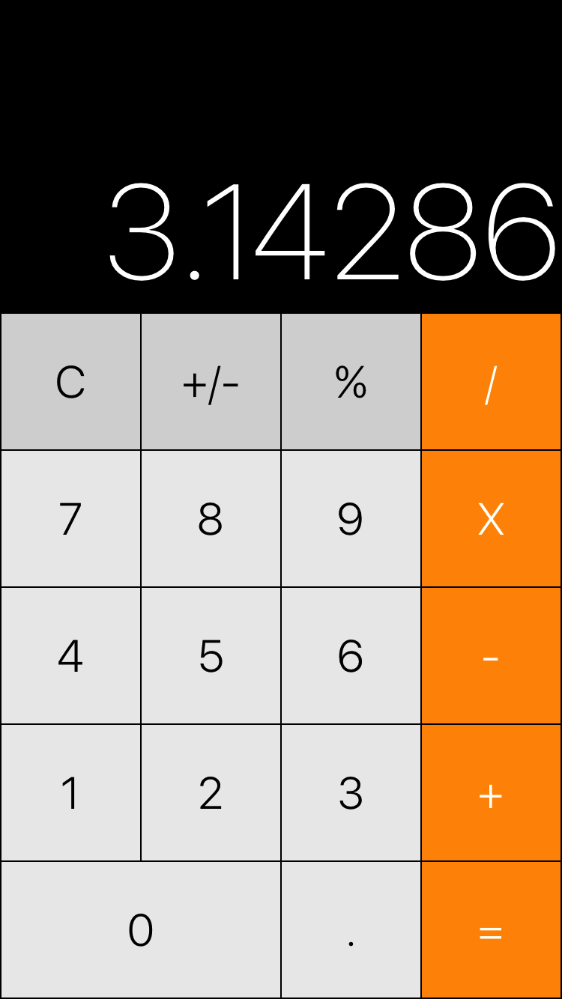

# Calculator
Basic calculator using Swift 3. The goal of this was just to learn the language.

## Built with
* [Swift 3.1](https://swift.org/documentation/)
* [Xcode 8.3.2](https://developer.apple.com/xcode/)
